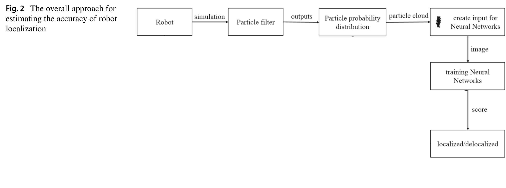

# Mobile Robot Particle Filter with Vision Transformer

This project simulates a mobile robot's localization using a particle filter algorithm and evaluates its state (localized or delocalized) using a Vision Transformer (ViT) model.

## Table of Contents
- [Mobile Robot Particle Filter with Vision Transformer](#mobile-robot-particle-filter-with-vision-transformer)
  - [Table of Contents](#table-of-contents)
  - [Overview](#overview)
    - [General overivew on localization using particle filters](#general-overivew-on-localization-using-particle-filters)
    - [Localization accuracy estimation approach](#localization-accuracy-estimation-approach)
    - [Generation of training data](#generation-of-training-data)
  - [Installation](#installation)
  - [Usage](#usage)
    - [Project Structure](#project-structure)
    - [Simulation](#simulation)
    - [Training the Model](#training-the-model)
    - [Inference](#inference)
  - [Acknowledgements](#acknowledgements)
  - [License](#license)

## Overview

This project involves the following key components:
- A simulation of a mobile robot using a particle filter for localization.
- Generation of training data by simulating different states of the robot.
- Training a Vision Transformer (ViT) model to classify the robot's state as localized or delocalized.
- Running the simulation and using the trained model for real-time inference.

### General overivew on localization using particle filters

Particle filters is a common method applied to mobile robot localization. This approach is favored for representing arbitrary probability distributions and resolving state estimation issues. The Monte Carlo method forms the foundation of particle filters.

Here is a general overview of localization using particle filters. First, the environment must be mapped. This is typically accomplished through a simultaneous localization and mapping (SLAM) approach. This method takes into account the movement of the robot (twist) and scanning data on the environment. The outcome is a map of the environment, which can be used in conjunction with scanner data and the robot's twist to estimate the robot's pose.

In our simulation, we presuppose that the map is already known. The robot itself generates the measurement data by calculating Euclidean distances to the landmarks. The particle filter algorithm then estimates the robot's pose based on this measurement data and the map.


### Localization accuracy estimation approach

To determine the accuracy of the robot's position estimation, we use the approach shown in the figure below. Our application requires solving a binary classification problem: the robot is either localized or delocalized. We mark the robot as delocalized if the estimated position and orientation diverge from the true position and orientation beyond a certain threshold.

To gain access to a ground truth of the position and orientation, and to intentionally provoke delocalization, we simulate the robot's motion and sensing (i.e., laser scans) as well as the environment. The data from the robot's perception and the particle filter-based pose estimation (i.e., particles) are recorded and converted into labeled training data for subsequent classification steps.



### Generation of training data

The figure below outlines the process of generating a training sample and identifying the correct label.


This process begins with a particle set from the particle filter, which is used to create a training image, x. Each particle represents a potential pose, including position and orientation, and carries a weight that reflects its importance. Given the performance of the particle filter is dependent on the size of the particle set, it's crucial to select a sufficient number of particles.

Next, we convert the particle set into a binary image. This format effectively represents the distribution of the particle set and is compatible with current machine learning tools. In the image, black pixels signify a particle from the particle cloud.

We label the image by comparing the exact pose retrieved from the simulation with the estimated pose obtained from the particle distribution. Using a defined distance alpha, beta as a threshold, we can classify the robot's localization state and create a corresponding label, y, for the training sample.

The formula used to label the image as localized or delocalized is provided below.


To train the Vision Transformer model, we generate a dataset of training samples and labels. The model learns to classify the robot's state based on the particle distribution images and corresponding labels.

## Installation

To set up the project, follow these steps:

1. **Clone the repository**:
   ```bash
   git clone https://github.com/turhancan97/mobile-robot-particle-filter-with-transformer.git
   cd mobile-robot-particle-filter-with-transformer
   ```

2. **Create a virtual environment (optional but recommended)**:
   ```bash
   conda create -n particle-filter python=3.9
   conda activate particle-filter
   ```

3. **Install the required dependencies**:
   ```bash
   pip install -r requirements.txt
   ```

## Usage

### Project Structure

- `train.py`: Script for training the Vision Transformer model.
- `inference.py`: Script for running the simulation and performing real-time inference.
- `data_generation.py`: Function for generating particle distribution images.
- `particle_filter_animation.py`: Contains the `Robot` class and particle filter logic.
- `README.md`: This file.

### Simulation

The simulation involves a mobile robot moving within a predefined environment, using particle filters to estimate its position and orientation.

### Training the Model

1. **Generate Training Data**:
   - Run the simulation to generate images representing different states (localized and delocalized).
   - Save the images in separate directories for training the Vision Transformer model.

2. **Train the Vision Transformer Model**:
   - Use `train.py` to train the model on the generated data.
   ```bash
   python train.py
   ```

### Inference

To run the simulation and monitor the robot's state in real-time, use `inference.py`.

```bash
python inference.py
```

This script will:
- Initialize the robot and particles.
- Move the robot and particles at each step.
- Use the trained Vision Transformer model to classify the robot's state.
- Visualize the simulation and classification results.

## Acknowledgements

This project is based on concepts from the paper:

- **Title**: Creating a robot localization monitor using particle filter and machine learning approaches
- **Authors**: Matthias Eder, Michael Reip, Gerald Steinbauer
- **Published in**: Springer / Applied Intelligence
- **Link**: [URL to the paper](https://link.springer.com/article/10.1007/s10489-020-02157-6)

The Vision Transformer model is implemented using the `timm` library.

The figures in this readme are directly taken from the paper above.

## License

This project is licensed under the MIT License. See the [LICENSE](LICENSE) file for details.